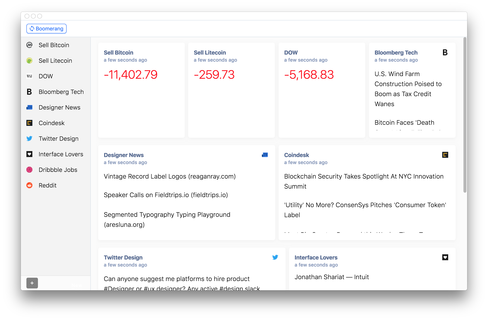

<div >
    <h3 align="center">Reflex</h3>
    <p align="center">Make responsive websites without the guesswork.</p>
</div>



Reflex is a free, open-source Mac app that makes it easy to see how responsive websites look at different screen sizes. Made for people who are tired of manually resizing their browser.

---

## Download

**[Download latest version (MacOS only)](https://github.com/nwittwer/Reflex/releases/latest)**

[Having issues installing?](#faq)

---

### Features:
- Preview your website across as many sizes as you want
- Screenshot individual screens or all at once
- Synchronized interactions (scrolling, clicks, form inputs)
- Chromium DevTools built-in

Check out our [upcoming features](../../projects) and [feature requests](../../issues&q=label%3Afeature-request). If you have an idea that you didn't see it in either of those places, you can create a [new Github issue](../../issues) for it!

---

## Contributing

Please take a look at the [upcoming features](../../projects) and the [open Github issues](../../issues). Bug reports and feature requests are welcome!

---

## Developing

Please use the following versions: 
- Node 10.0+, NPM 6+

1. Clone the project to your computer:
    ```sh
    $ git clone https://github.com/nwittwer/reflex.git
    $ cd reflex
    ```

2. Install dependencies:
    ```sh
    $ npm install --no-optional
    ```

3. Compile and watch for changes:
    ```sh
    $ npm run start
    ```

4. To compile for the final app, run the following command: 
    
    ```sh
    $ npm run build
    ```

    This will output several files inside of the `build/` folder. You can directly run the `.app` file inside of `build/mac/`.

### Debugging

`CMD + Shift + I` will open the Chrome DevTools.

### Technologies used

- [VueJS](https://vuejs.org/)
- [Electron](https://electronjs.org/)
- [BrowserSync](https://www.browsersync.io/)

---

## FAQ

1. Help installing for MacOS
    1. Move the Application to your Applications folder
    2. Open the application by double-clicking the icon
    3. If asked if you would like to open the application that was downloaded from the Internet, confirm. This is a standard MacOS security feature.

2. Does Shift work on Windows OS?
At the moment, only the Mac version is being supported/tested, as it requires a large amount of effort to add another OS to support. With more help, most or all of this project could work on the web, MacOS, and Windows.

3. Issues with BrowserSync/Node-GYP? Try removing `node_modules` and `package-lock.json` and re-installing with `npm install --no-optional`.


---

## License

[MIT](LICENSE)
